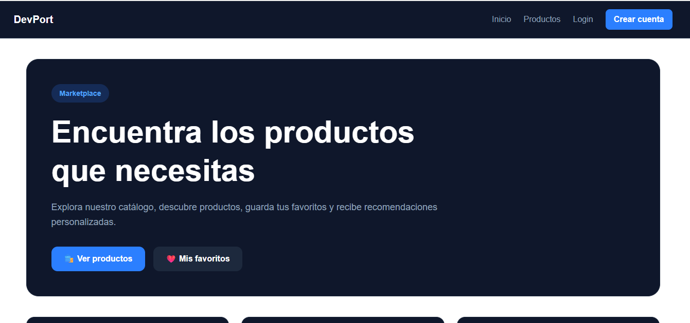
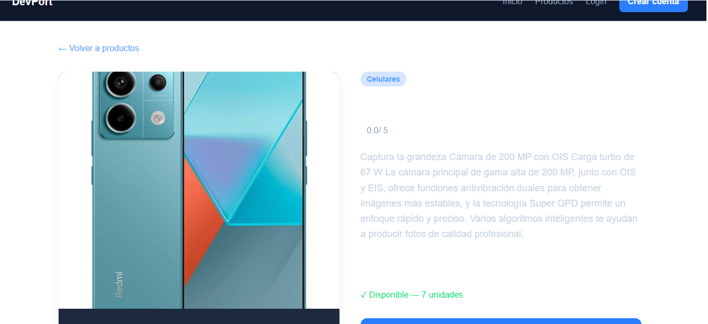
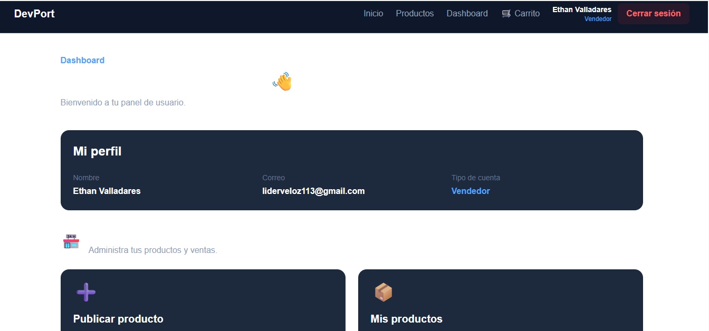

# Marketplace

Plataforma web de comercio electrónico que permite a compradores explorar productos, gestionar favoritos, carrito y pedidos. Los vendedores pueden crear y administrar productos, controlar inventario y consultar ventas. El sistema también incorpora recomendaciones de productos mediante un motor híbrido basado en datos históricos y productos reales almacenados en Supabase.

🔗 **Demo en vivo:** https://marketplace-rho-drab.vercel.app/

🔗 **Repositorio:** https://github.com/franklin1978-cloud/Marketplace

## Video de presentación

🎥 [Ver video del proyecto — Examen Aplicaciones Web](https://ister-my.sharepoint.com/:v:/g/personal/franklin_valladares_ister_edu_ec/IQAp7kMd-4JTRq2t9VzIMd9rAfYoLA-ToqLSDeiryDvkAYQ?nav=eyJyZWZlcnJhbEluZm8iOnsicmVmZXJyYWxBcHAiOiJPbmVEcml2ZUZvckJ1c2luZXNzIiwicmVmZXJyYWxBcHBQbGF0Zm9ybSI6IldlYiIsInJlZmVycmFsTW9kZSI6InZpZXciLCJyZWZlcnJhbFZpZXciOiJNeUZpbGVzTGlua0NvcHkifX0&e=8pT8pB)

## Capturas de pantalla

### Página principal y catálogo



### Detalle de producto y recomendaciones



### Panel del vendedor




## Stack tecnológico

* **Next.js 16.2.9** — Framework principal utilizando App Router.
* **React 19.2.4** — Biblioteca para la interfaz de usuario.
* **TypeScript 5** — Tipado estático.
* **Tailwind CSS 4** — Estilos y diseño de la interfaz.
* **Supabase** — Base de datos PostgreSQL, autenticación y almacenamiento.
* **@supabase/supabase-js** — Cliente de Supabase.
* **@supabase/ssr** — Integración de Supabase con Next.js.
* **localStorage** — Persistencia local del carrito.
* **JSON / ML** — Dataset y señales utilizadas para recomendaciones.
* **Git / GitHub** — Control de versiones.
* **Vercel** — Despliegue y hosting de la aplicación.

## Roles de usuario

### Comprador

* Registrarse e iniciar sesión.
* Consultar el catálogo de productos.
* Ver el detalle de los productos.
* Agregar productos a favoritos.
* Agregar productos al carrito.
* Modificar cantidades del carrito.
* Realizar el proceso de checkout.
* Consultar pedidos y detalles de pedidos.
* Publicar opiniones sobre productos comprados.

### Vendedor

* Crear productos manualmente.
* Administrar productos.
* Subir imágenes de productos.
* Administrar inventario.
* Consultar ventas.
* Gestionar productos almacenados en Supabase.

### Administrador

No se implementó un panel administrativo independiente en la versión actual.

## Modelo de datos

El sistema utiliza **Supabase PostgreSQL** como base de datos principal.

Las entidades principales son:

* **productos** — almacena información del catálogo.
* **pedidos** — registra los pedidos realizados por los compradores.
* **detalle_pedidos** — relaciona los pedidos con los productos comprados.
* **favoritos** — relaciona usuarios con productos guardados.
* **opiniones** — almacena las opiniones de compradores sobre productos.

Relaciones principales:

```text
usuarios
   │
   ├───────────────┐
   │               │
   ▼               ▼
pedidos         favoritos
   │               │
   ▼               ▼
detalle_pedidos   productos
   │               │
   └───────►───────┤
                   ▼
                opiniones
```

Las imágenes de los productos se almacenan mediante **Supabase Storage** en el bucket:

```text
productos
```

## Sistema de recomendaciones

El proyecto utiliza un sistema híbrido de recomendaciones.

```text
recommendations-v2-1.json
          │
          ▼
Señales del modelo ML
          │
          ▼
Motor de recomendaciones
          │
          ▼
Productos reales de Supabase
          │
          ▼
Recomendaciones mostradas
```

El dataset de recomendaciones funciona como fuente de señales, mientras que **Supabase es la fuente oficial del catálogo**.

Esto permite que los vendedores puedan crear productos manualmente aunque estos no existan en el dataset histórico.

Si un producto no tiene recomendaciones disponibles, el sistema continúa funcionando normalmente y no genera errores.

## Instalación local

### 1. Clonar el repositorio

```bash
git clone https://github.com/franklin1978-cloud/Marketplace.git
```

### 2. Entrar al proyecto

```bash
cd Marketplace/devport
```

### 3. Instalar dependencias

```bash
npm install
```

### 4. Configurar variables de entorno

Crear un archivo:

```text
.env.local
```

Agregar las variables correspondientes de Supabase:

```env
NEXT_PUBLIC_SUPABASE_URL=tu_url_de_supabase
NEXT_PUBLIC_SUPABASE_PUBLISHABLE_KEY=tu_clave_publicable
```


### 5. Ejecutar el proyecto

```bash
npm run dev
```

Para utilizar específicamente el puerto 3001:

```bash
npm run dev -- -p 3001
```

La aplicación estará disponible en:

```text
http://localhost:3001
```

### 6. Verificar la compilación

```bash
npm run build
```

## Variables de entorno

El proyecto requiere las siguientes variables:

| Variable                               | Descripción               |
| -------------------------------------- | ------------------------- |
| `NEXT_PUBLIC_SUPABASE_URL`             | URL del proyecto Supabase |
| `NEXT_PUBLIC_SUPABASE_PUBLISHABLE_KEY` | Clave pública de Supabase |

Los valores reales deben configurarse en `.env.local` para desarrollo y en las variables de entorno de Vercel para producción.

## Credenciales de prueba

Por seguridad, las credenciales reales de producción **no se almacenan en este README ni en GitHub**.

Estas son cuentas específicas de prueba:

* **Comprador:** `liderveloz112@gmail.com` / `[Frank1978]`
* **Vendedor:** `liderveloz113@gmail.com` / `[Frank1978]`


## Funcionalidades principales

### Autenticación

* [x] Registro
* [x] Inicio de sesión
* [x] Supabase Auth

### Catálogo

* [x] Listado de productos
* [x] Detalle de producto
* [x] Categorías
* [x] Precio
* [x] Stock
* [x] Calificación
* [x] Imágenes
* [x] Productos creados manualmente

### Favoritos

* [x] Agregar productos
* [x] Eliminar productos
* [x] Visualizar favoritos

### Carrito

* [x] Agregar productos
* [x] Eliminar productos
* [x] Aumentar cantidades
* [x] Disminuir cantidades
* [x] Control de stock
* [x] Cálculo de cantidades
* [x] Cálculo del precio total
* [x] Persistencia mediante localStorage

### Checkout y pedidos

* [x] Checkout
* [x] Creación de pedidos
* [x] Consulta de pedidos
* [x] Detalle de pedidos
* [x] Confirmación de pedidos

### Vendedor

* [x] Crear productos
* [x] Subir imágenes
* [x] Administrar inventario
* [x] Consultar ventas
* [x] Gestionar productos manualmente

### Opiniones

* [x] Publicar opiniones
* [x] Validación de compra antes de opinar
* [x] Evitar opiniones duplicadas sobre el mismo producto

### Recomendaciones

* [x] Dataset de recomendaciones
* [x] Recomendaciones basadas en score
* [x] Productos similares
* [x] Exclusión del producto actual
* [x] Límite de resultados
* [x] Integración con productos reales de Supabase
* [x] Compatibilidad con productos creados manualmente
* [x] Manejo de productos sin recomendaciones

## API

El proyecto dispone de los siguientes endpoints principales:

```text
/api/productos
/api/favoritos
/api/recomendaciones
/api/vendedor/inventario
```

## Despliegue

El proyecto está desplegado en **Vercel** y conectado directamente con el repositorio de GitHub.

```text
GitHub
   │
   ▼
Vercel
   │
   ▼
Producción
```

Cada cambio enviado al repositorio puede generar un nuevo deployment en Vercel.

## Versión estable

**Marketplace v1.0.0**

Esta versión corresponde al estado funcional validado en producción, incluyendo catálogo, productos manuales, autenticación, favoritos, carrito, checkout, pedidos, inventario, opiniones y recomendaciones.

## Autor

**Franklin Valladares**

Proyecto Final Aplicaciones Web — Marketplace.
